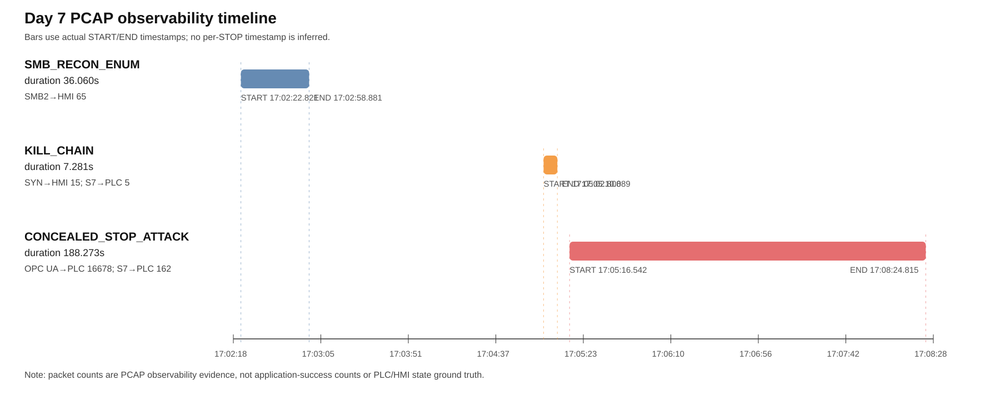

# Day 7 - Kiểm toán khả năng quan sát từ PCAP offline

Ngày tạo: 2026-09-25T13:32:52.096594Z

Phạm vi thao tác: chỉ đọc timeline và PCAP Day 7, giải nén PCAP vào thư mục tạm, chạy `tshark` offline, tạo artifact mới trong `experiments/day7_research/pcap_observability/`. Không sửa PCAP gốc, dataset, model, artifact cũ hoặc file DOCX; không chạy huấn luyện, không chạy kịch bản tấn công và không kết nối PLC.

## 1. Đầu vào và tính tái lập

- Timeline: `labels/day7_final_timeline.csv`
- PCAP ZIP: `data_opc/day7/ot-capture-ot1788454936.zip`
- Báo cáo quyết định đã duyệt hướng 2: `experiments/day7_research/DAY7_RESEARCH_DECISION_VI.md`
- Script tái lập: `experiments/day7_research/pcap_observability/reproduce_day7_pcap_observability.py`
- Lệnh chạy lại từ gốc repository:

```bash
python3 experiments/day7_research/pcap_observability/reproduce_day7_pcap_observability.py
```

SHA-256 đầu vào:

| File | SHA-256 |
|---|---|
| `labels/day7_final_timeline.csv` | `bde78f9ab5845e6a0b42d2ecd5e077d8c890fcd36d527f5ed9feb948aff24ed9` |
| `data_opc/day7/ot-capture-ot1788454936.zip` | `3742e8251a2d99f80c36c58dace287f0b78003d3f187691ec2d2018136fa10f6` |
| `experiments/day7_research/DAY7_RESEARCH_DECISION_VI.md` | `7329d820d65dbfa78088fcbadf14a8129e341713c07e1e086a4e9ac4f6eff2fd` |

## 2. Kiểm tra PCAP segment và cơ chế near-duplicate filtering

ZIP PCAP chứa 7 segment. Script kiểm tra khoảng thời gian từng segment trước khi tổng hợp và ghi kết quả trong `segment_overlap_audit.csv`.

- Số cặp segment có chồng lấn thời gian dương: 0.
- Mỗi bộ lọc xuất đồng thời `raw_frame_count`, `dedup_packet_count`, `near_duplicate_count` và `exact_duplicate_count`.
- `dedup_packet_count` là kết quả của **heuristic near-duplicate filtering**: frame sau bị loại nếu xuất hiện trong vòng 1,5 ms và có cùng Ethernet/IP/TCP tuple, `tcp.seq`, `tcp.ack`, `tcp.len` và `frame.len` với frame ngay trước đó của cùng tuple. Mục tiêu là giảm nguy cơ đếm hai lần cùng một record khi capture nhiều interface hoặc khi file segment có record gần-trùng.
- Heuristic này **không đủ bằng chứng để khẳng định mọi frame bị loại đều là bản sao đã xác minh**. Một số frame hợp lệ, ACK lặp nhanh, hoặc TCP retransmission/header gần giống nhau có thể rơi vào tiêu chí gần-trùng. Vì vậy báo cáo giữ cả raw và dedup, đặc biệt với TCP/102 trong `CONCEALED_STOP_ATTACK`: raw `3.752` frame hai chiều, sau heuristic còn `2.087` frame, `near_duplicate_count=1.665`.
- Các số decoded S7comm chính không bị ảnh hưởng bởi heuristic trong đợt này: S7comm concealed hướng tới PLC raw/dedup đều `162`, hai chiều raw/dedup đều `324`.

## 3. Timeline ba giai đoạn

| scenario_label | start_iso_utc | end_iso_utc | duration_s | pcap_observable_highlights |
| --- | --- | --- | --- | --- |
| SMB_RECON_ENUM | 2026-09-03T17:02:22.821000Z | 2026-09-03T17:02:58.881000Z | 36.060 | smb2_hmi_dst_445_decoded=65; tcp445_hmi_dst_all=436; tcp445_hmi_two_way_all=781 |
| KILL_CHAIN | 2026-09-03T17:05:02.808000Z | 2026-09-03T17:05:10.089000Z | 7.281 | tcp_syn_to_hmi=15; kill_s7comm_to_plc_decoded=5; kill_s7comm_plc_two_way_decoded=10; kill_tcp102_plc_two_way_all=88 |
| CONCEALED_STOP_ATTACK | 2026-09-03T17:05:16.542000Z | 2026-09-03T17:08:24.815000Z | 188.273 | opcua_to_plc_decoded=16678; opcua_plc_two_way_decoded=33389; tcp4840_to_plc_all=18263; tcp4840_plc_two_way_all=36219; concealed_s7comm_to_plc_decoded=162; concealed_s7comm_plc_two_way_decoded=324; concealed_tcp102_to_plc_all=885; concealed_tcp102_plc_two_way_all=2087 |

Hình đề xuất cho báo cáo/slide:



Hình này chỉ đặt ba thanh theo timestamp START/END thực tế trong timeline. Không nội suy vị trí từng STOP vì artifact hiện không có timestamp từng STOP.

## 4. Kết quả kiểm toán PCAP theo từng giai đoạn

| scenario_label | evidence_id | protocol_scope | direction_scope | raw_frame_count | dedup_packet_count | near_duplicate_count | first_packet_iso_utc | last_packet_iso_utc | observed_duration_s |
| --- | --- | --- | --- | --- | --- | --- | --- | --- | --- |
| SMB_RECON_ENUM | smb2_hmi_dst_445_decoded | decoded_smb2 | to_hmi | 65 | 65 | 0 | 2026-09-03T17:02:22.826752Z | 2026-09-03T17:02:58.387584Z | 35.560832023620605 |
| SMB_RECON_ENUM | tcp445_hmi_dst_all | all_tcp_445 | to_hmi | 485 | 436 | 49 | 2026-09-03T17:02:22.826382Z | 2026-09-03T17:02:58.389605Z | 35.563223123550415 |
| SMB_RECON_ENUM | tcp445_hmi_two_way_all | all_tcp_445 | two_way_hmi | 970 | 781 | 189 | 2026-09-03T17:02:22.826382Z | 2026-09-03T17:02:58.390001Z | 35.5636191368103 |
| KILL_CHAIN | tcp_syn_to_hmi | tcp_syn | to_hmi | 15 | 15 | 0 | 2026-09-03T17:05:05.830671Z | 2026-09-03T17:05:09.436442Z | 3.6057708263397217 |
| KILL_CHAIN | kill_s7comm_to_plc_decoded | decoded_s7comm | to_plc | 5 | 5 | 0 | 2026-09-03T17:05:02.818823Z | 2026-09-03T17:05:02.827498Z | 0.008674860000610352 |
| KILL_CHAIN | kill_s7comm_plc_two_way_decoded | decoded_s7comm | two_way_plc | 10 | 10 | 0 | 2026-09-03T17:05:02.818823Z | 2026-09-03T17:05:02.828043Z | 0.009219884872436523 |
| KILL_CHAIN | kill_tcp102_plc_two_way_all | all_tcp_102 | two_way_plc | 159 | 88 | 71 | 2026-09-03T17:05:02.818013Z | 2026-09-03T17:05:10.086051Z | 7.268038034439087 |
| CONCEALED_STOP_ATTACK | opcua_to_plc_decoded | decoded_opcua | to_plc | 16678 | 16678 | 0 | 2026-09-03T17:05:16.545892Z | 2026-09-03T17:08:24.811304Z | 188.26541209220886 |
| CONCEALED_STOP_ATTACK | opcua_plc_two_way_decoded | decoded_opcua | two_way_plc | 33389 | 33389 | 0 | 2026-09-03T17:05:16.545034Z | 2026-09-03T17:08:24.811304Z | 188.26627016067505 |
| CONCEALED_STOP_ATTACK | tcp4840_to_plc_all | all_tcp_4840 | to_plc | 20490 | 18263 | 2227 | 2026-09-03T17:05:16.545892Z | 2026-09-03T17:08:24.811304Z | 188.26541209220886 |
| CONCEALED_STOP_ATTACK | tcp4840_plc_two_way_all | all_tcp_4840 | two_way_plc | 40503 | 36219 | 4284 | 2026-09-03T17:05:16.545034Z | 2026-09-03T17:08:24.811304Z | 188.26627016067505 |
| CONCEALED_STOP_ATTACK | concealed_s7comm_to_plc_decoded | decoded_s7comm | to_plc | 162 | 162 | 0 | 2026-09-03T17:05:16.617500Z | 2026-09-03T17:08:24.798752Z | 188.18125200271606 |
| CONCEALED_STOP_ATTACK | concealed_s7comm_plc_two_way_decoded | decoded_s7comm | two_way_plc | 324 | 324 | 0 | 2026-09-03T17:05:16.617500Z | 2026-09-03T17:08:24.799403Z | 188.181902885437 |
| CONCEALED_STOP_ATTACK | concealed_tcp102_to_plc_all | all_tcp_102 | to_plc | 1518 | 885 | 633 | 2026-09-03T17:05:16.572362Z | 2026-09-03T17:08:24.800621Z | 188.2282590866089 |
| CONCEALED_STOP_ATTACK | concealed_tcp102_plc_two_way_all | all_tcp_102 | two_way_plc | 3752 | 2087 | 1665 | 2026-09-03T17:05:16.571643Z | 2026-09-03T17:08:24.800873Z | 188.229229927063 |

Diễn giải thận trọng:

- `SMB_RECON_ENUM`: PCAP xác nhận lưu lượng SMB2/TCP445 tới HMI trong cửa sổ recon. Counter `probes=140` là số nội bộ của module; không đồng nhất với số packet SMB2 giải mã được.
- `KILL_CHAIN`: PCAP xác nhận SYN tới HMI và S7comm/TCP102 với PLC trong cửa sổ kill-chain. Đây là bằng chứng quan sát trên dây, không phải bằng chứng khai thác dịch vụ HMI thành công.
- `CONCEALED_STOP_ATTACK`: PCAP xác nhận burst OPC UA/TCP4840 và lưu lượng S7comm/TCP102 cùng hiện diện trong interval concealed stop. Điều này hỗ trợ narrative “kênh OPC UA ghi/đọc và kênh S7 STOP/START cùng hoạt động”, nhưng không chứng minh độc lập trạng thái vật lý PLC hoặc màn hình HMI.

## 5. Truy vết counter và giới hạn diễn giải

Từ timeline:

- SMB recon: `probes=140`.
- Concealed stop: `stops=9`, `conceal_attempts=13604`, `conceal_ok=13604`, `conceal_failed=0`.
- Read-back: `183/1026 = 17.8363%` mẫu sampler nội bộ đọc lại `BangTai=True`.
- Tham số module: `dur=180s`; khoảng START-END timeline: `188.273s`.

Phân biệt bằng chứng:

| Đại lượng | Nguồn | Có thể kết luận | Không được kết luận |
|---|---|---|---|
| `probes=140` | counter module SMB | Module đã thực hiện 140 probe theo logic script | Có đúng 140 gói SMB2 trên dây |
| `stops=9` | counter module concealed stop | Script đã đi qua 9 chu kỳ ghi STOP theo logic của nó | PLC chắc chắn đổi trạng thái vật lý 9 lần nếu thiếu process log |
| `conceal_attempts=13604`, `conceal_ok=13604` | counter API client | Client gửi nhiều write và API không báo exception | 13.604 thay đổi trạng thái PLC/HMI thành công |
| `183/1026` read-back True | sampler nội bộ client | Tại một phần mẫu đọc lại, client thấy `BangTai=True` | Tỷ lệ thời gian HMI bị che giấu hoặc tỷ lệ thành công độc lập |
| OPC UA/S7comm trong PCAP | capture mạng | Có lưu lượng tương ứng trên dây trong interval | Hành vi tấn công đã thành công ở tầng tiến trình |

## 6. Trả lời câu hỏi nghiên cứu

### A. Chuỗi hành vi nhiều giai đoạn có những dấu hiệu nào quan sát được từ PCAP?

Có. PCAP quan sát được ba nhóm dấu hiệu đúng theo timeline: SMB2/TCP445 tới HMI trong `SMB_RECON_ENUM`; SYN tới HMI và S7comm với PLC trong `KILL_CHAIN`; burst OPC UA/TCP4840 cùng S7comm/TCP102 với PLC trong `CONCEALED_STOP_ATTACK`.

### B. Bằng chứng nào độc lập với counter của module?

Các số trong `day7_pcap_observability_audit.csv` là bằng chứng mạng trích xuất lại từ PCAP, độc lập với counter nội bộ module. Cụ thể: số packet SMB2/SYN/S7comm/OPC UA, timestamp gói đầu/cuối và chiều truyền. Tuy nhiên PCAP vẫn là capture của cùng đợt kiểm thử, không phải một nguồn thu thập hoàn toàn độc lập về trạng thái tiến trình.

### C. Có thể liên hệ điều gì giữa lưu lượng OPC UA và S7comm trong cùng khoảng kiểm thử?

Trong interval `CONCEALED_STOP_ATTACK`, PCAP cho thấy đồng thời có OPC UA/TCP4840 tới PLC và S7comm/TCP102 tới PLC. Điều này phù hợp với thiết kế script: một kênh OPC UA ghi/đọc `BangTai`, trong khi kênh S7 điều khiển START/STOP. Liên hệ này là quan sát đồng thời trên mạng, không phải chứng minh trực tiếp rằng mỗi write OPC UA tương ứng với một thay đổi trạng thái PLC.

### D. Những kết luận nào chưa thể đưa ra?

Chưa thể kết luận trạng thái vật lý PLC, trạng thái hiển thị HMI theo thời gian, duration bất nhất, latency phát hiện hoặc precision/recall của một cơ chế phát hiện bất nhất. Lý do là repo hiện thiếu process tag log Day 7, log HMI/WinCC có timestamp, export LAD/TIA Portal hoặc timestamp từng STOP/read-back.

### E. Case-study đã đủ điều kiện tích hợp vào đồ án chưa?

Có, ở mức **case-study quan sát đa giai đoạn dựa trên PCAP**, đi kèm giới hạn rõ ràng. Không nên trình bày như thực nghiệm đánh giá phát hiện bất nhất hoặc IDS có precision/recall, vì chưa có ground truth process/HMI tương ứng.

## 7. Nội dung bổ sung đề xuất cho mục 3.11

**Case-study Day 7: quan sát chuỗi hành vi tấn công nhiều giai đoạn từ PCAP.** Day 7 được sử dụng như một case-study bổ sung cho testbed, nhằm kiểm tra khả năng ghi nhận một chuỗi hành vi gồm do thám HMI, pivot/foothold qua S7 và thao tác che giấu trạng thái qua OPC UA. Timeline gồm ba interval: `SMB_RECON_ENUM`, `KILL_CHAIN` và `CONCEALED_STOP_ATTACK`. Khác với nhánh Day 8 dùng cho đánh giá IDS theo cửa sổ, Day 7 không được trộn vào tập huấn luyện/đánh giá mô hình mà được phân tích như bằng chứng vận hành và quan sát mạng. Nguồn dữ liệu chính gồm timeline nhãn, PCAP nhiều segment và mã nguồn sinh kịch bản. Các counter của module được dùng để giải thích ý nghĩa thao tác, trong khi PCAP được dùng để xác nhận độc lập sự hiện diện của lưu lượng SMB2, SYN, S7comm và OPC UA trên dây. Phạm vi kết luận được giới hạn ở khả năng quan sát mạng; đồ án không suy diễn packet count thành số thao tác ứng dụng thành công hay trạng thái vật lý của PLC/HMI.

## 8. Nội dung bổ sung đề xuất cho mục 5.9.6

**Kết quả kiểm toán PCAP Day 7.** Kiểm toán offline trên PCAP Day 7 xác nhận chuỗi ba giai đoạn có dấu hiệu quan sát được trên mạng. Trong cửa sổ `SMB_RECON_ENUM`, PCAP ghi nhận lưu lượng SMB2/TCP445 tới HMI, trong khi counter nội bộ module ghi `probes=140`. Trong cửa sổ `KILL_CHAIN`, PCAP ghi nhận SYN tới HMI và lưu lượng S7comm với PLC, phù hợp với mô tả pivot/foothold nhưng không chứng minh khai thác dịch vụ HMI. Trong cửa sổ `CONCEALED_STOP_ATTACK`, timeline ghi `stops=9`, `conceal_attempts=13604`, `conceal_ok=13604`, `conceal_failed=0` và `183/1026` mẫu read-back còn `BangTai=True`; PCAP đồng thời ghi nhận burst OPC UA/TCP4840 và S7comm/TCP102 với PLC. Kết quả này đủ để tích hợp Day 7 như một case-study quan sát đa giao thức, nhưng chưa đủ để tính precision/recall cho phát hiện bất nhất vì thiếu process log, LAD export và HMI log có timestamp.

## 9. Bảng/hình nên đưa vào Word

Để tránh làm đồ án dài, chỉ nên thêm:

1. Một bảng bằng chứng chính lấy từ `day7_evidence_matrix.csv`, rút gọn còn các dòng: SMB recon, kill-chain SYN/S7comm, concealed stop OPC UA/S7comm, counter/read-back và giới hạn.
2. Một hình timeline mới: `day7_three_stage_timeline.svg` hoặc bản PNG nếu cần cho Word/slide.

## 10. Đối chiếu với số liệu hiện có trong DOCX

Đã trích xuất `bao-cao/Thao_Tu_OTSecurity_vf.docx` ở chế độ đọc-only để tìm các đoạn Day 7 hiện có. Các mốc P dưới đây là thứ tự paragraph khi đọc `word/document.xml`, dùng để định vị lúc biên tập thủ công; chúng không phải số trang Word chính thức.

| Vị trí DOCX hiện có | Nội dung hiện có | Kết quả kiểm toán PCAP mới | Khuyến nghị sửa |
|---|---|---|---|
| P1278-P1284, mục 3.11 và 3.11.1 | Giới thiệu Day 7 là case-study, giữ ba kịch bản `SMB_RECON_ENUM`, `KILL_CHAIN`, `CONCEALED_STOP_ATTACK`. | Phù hợp với artifact mới. | Giữ mạch hiện tại; bổ sung 1 câu rằng case-study đã được kiểm toán lại bằng PCAP offline tại `experiments/day7_research/pcap_observability/`. |
| P1286, mục 3.11.2 | `9` STOP, `13.604` write, `183/1.026 = 17,8%` read-back còn True. | Đây là counter/module, không phải số packet. Kiểm toán PCAP không thay thế các counter này. | Giữ số cũ; có thể viết `17,84%` nếu muốn nhất quán phép tính. Nhấn mạnh đây là tỷ lệ mẫu read-back của client, không phải tỷ lệ thời gian che giấu HMI. |
| Bảng 3.17, P1288-P1306 | Bảng counter của `CONCEALED_STOP_ATTACK`. | Artifact mới bổ sung bằng chứng PCAP, nhưng không biến counter thành ground truth PLC/HMI. | Có thể giữ Bảng 3.17 là bảng counter; nếu thêm bảng mới thì chỉ thêm một bảng bằng chứng rút gọn từ `day7_evidence_matrix.csv`, tránh lặp toàn bộ CSV. |
| P1307 | “16.680 gói OPC UA hướng tới PLC và 162 gói S7comm…” | Decoded OPC UA hướng tới PLC = `16.678`; decoded OPC UA hai chiều = `33.389`. S7comm hướng tới PLC = `162`; S7comm hai chiều = `324`. | Sửa `16.680` thành `16.678` nếu muốn khớp artifact mới; giữ `162` nếu chú thích rõ là S7comm hướng tới PLC. Tránh gọi TCP/102 nền là TLS/S7CommPlus nếu chưa có artifact giải mã chắc chắn. |
| P1308-P1314 | Đã phân biệt read-back với thời lượng HMI và nêu giới hạn cấu hình. | Phù hợp với kết luận mới. | Giữ; có thể thêm “PCAP chỉ xác nhận lưu lượng trên dây, không xác nhận trạng thái vật lý/HMI”. |
| P1315-P1318 | Giới hạn Ngày 7 và kết quả âm. | Phù hợp. | Giữ nguyên; không bổ sung precision/recall hoặc claim phát hiện bất nhất. |
| P2114-P2117, mục 5.9.6 | Liên hệ Day 7 với kết quả OPC UA, hiện chủ yếu dựa trên counter read-back. | Có thêm bằng chứng PCAP độc lập với counter: SMB2→HMI `65`, SYN→HMI `15`, OPC UA→PLC `16678`, S7comm→PLC `162`. | Bổ sung một đoạn ngắn sau P2115 hoặc P2116: “kiểm toán PCAP offline xác nhận chuỗi observability nhiều giai đoạn…”. Không đưa Day 7 vào bảng hiệu năng học máy. |

Các số liệu nên dùng khi tích hợp:

| Nội dung | Số/tuyên bố cũ thường gặp | Kết quả kiểm toán mới | Cách viết an toàn |
|---|---:|---:|---|
| SMB2 tới HMI | 65 gói SMB2 | `65` decoded SMB2 tới HMI; TCP/445 tới HMI dedup `436` | “65 gói SMB2 giải mã được tới HMI; 436 frame TCP/445 tới HMI sau lọc gần-trùng”. |
| SYN tới HMI | 15 SYN | `15` SYN | “15 SYN tới HMI”, không gọi là khai thác thành công. |
| S7comm kill-chain | 5 hoặc 10 gói tùy cách đếm | to-PLC `5`; two-way `10` | Ghi rõ “5 gói S7comm hướng tới PLC” hoặc “10 gói S7comm hai chiều”. |
| OPC UA concealed | khoảng 16.680 gói | to-PLC decoded `16.678`; two-way decoded `33.389` | Dùng `16.678` nếu theo artifact mới; nêu đây là decoded OPC UA hướng tới PLC. |
| S7comm concealed | 162 gói | to-PLC `162`; two-way `324` | Giữ `162` nếu định nghĩa là hướng tới PLC; nếu hai chiều thì dùng `324`. |
| TCP/102 nền/S7CommPlus-like | 3.702 TLS/S7CommPlus | TCP/102 two-way concealed raw `3.752`, sau heuristic `2.087` | Viết “TCP/102 two-way” hoặc “lưu lượng nền TCP/102”; không gọi là TLS/S7CommPlus nếu chưa có artifact giải mã. |
| Read-back 17,8% | 183/1.026 | `183/1026=17.84%` | “tỷ lệ mẫu read-back của client”, không phải tỷ lệ thời gian che giấu HMI. |

## 11. Artifact đầu ra

- `day7_pcap_observability_audit.csv`: số đếm theo bộ lọc PCAP, timestamp gói đầu/cuối, chiều truyền và số gần-trùng đã loại.
- `day7_stage_timeline.csv`: timeline START/END ba giai đoạn và counter.
- `day7_evidence_matrix.csv`: bảng đối chiếu câu hỏi nghiên cứu - timeline/counter - PCAP - giới hạn.
- `segment_overlap_audit.csv`: kiểm tra khoảng thời gian các PCAP segment.
- `day7_three_stage_timeline.svg`: hình timeline ba giai đoạn dựa trên timestamp thực.
- `day7_three_stage_timeline.png`: bản raster nếu môi trường tạo được.
- `day7_pcap_observability_metadata.json`: hash đầu vào, lệnh chạy và metadata môi trường.
- `DAY7_PCAP_OBSERVABILITY_REPORT.md`: báo cáo này.
